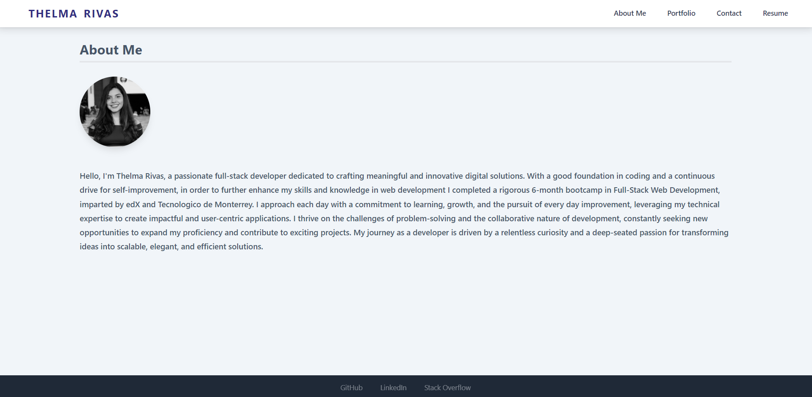

# My dev Portfolio

## Table of Contents

- [Description](#description)
- [Features](#features)
- [Technologies Used](#technologies-used)
- [Installation](#usage)
- [Usage](#usage)
- [License](#license)
- [Contributing](#contributing)

## Description

This Portfolio is my personal web portfolio showcasing my front-end and design skills. It includes a collection of my projects, demonstrating my abilities and experience in web development through an application built with React. This portfolio not only serves as a display of projects but also as a tool demonstrate proficiency in using the latest technologies like React. By creating this portfolio, developers can present their work effectively to potential employers and collaborators within the development community. This portfolio counts with a polish and responsive design.

## Features

- Single-page application layout with header, content section, and footer
- Navigation titles for About Me, Portfolio, Contact, and Resume
- Dynamic section changes based on navigation selection
- Default selection of About Me section on initial load
- Display of developer's photo and bio in the About Me section
- Showcase of six applications with links to deployed versions and GitHub repositories in the Portfolio section
- Contact form with name, email address, and message fields in the Contact section
- Field validation and notifications for required fields and email format
- Link to downloadable resume and list of proficiencies in the Resume section
- Footer with links to developer's GitHub, LinkedIn, and third-platform profiles, Stack Overflow in this case.

## Technologies Used

- JavaScript
- React
- Tailwind CSS
- HTML

## Installation

To install the portfolio application on your local machine, you can use the following steps:

1. Clone the repository: `git clone https://github.com/ThelmaRivas/mydev-portfolio.git` 
2. Navigate into the directory: `cd mydev-portfolio`
3. Install the dependencies: `npm install`
4. Start the application: `npm start`

## Usage

To use the portfolio application, cd into the directory and start the application: `npm start` or `npm run start` and visit http://localhost:3000 in your web browser. Explore the different sections of the portfolio such as About Me, Portfolio, Contact, and Resume. Test the functionality of the contact form with field validations. All sections count with Responsive design.

Here is a screenshot of the application when running npm start:  and the link to the deployed app on Netlify: [mydev-portfolio.netlify.app](https://mydev-portfolioo.netlify.app/)

## License

This project is licensed under the MIT License. See the [LICENSE.md](./LICENSE) file for details.

## Contributing

Contributions are welcome, you can contact me for any suggestions or improvements.
